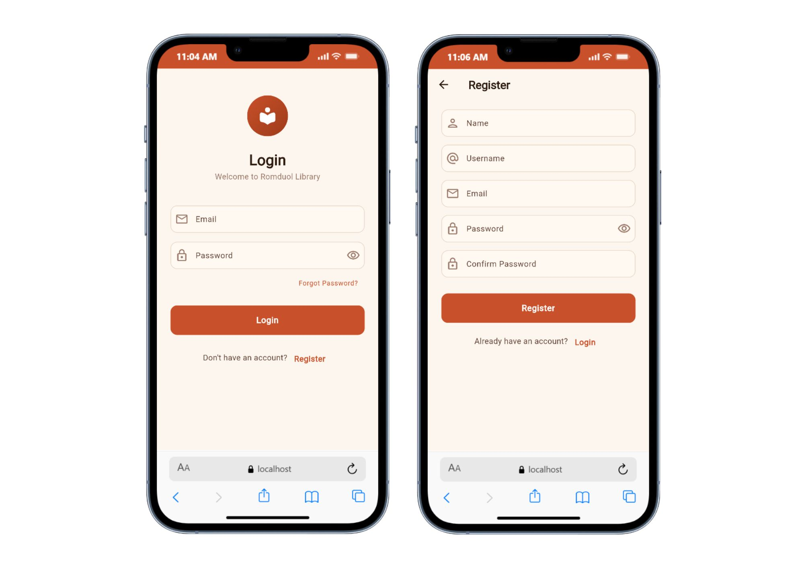
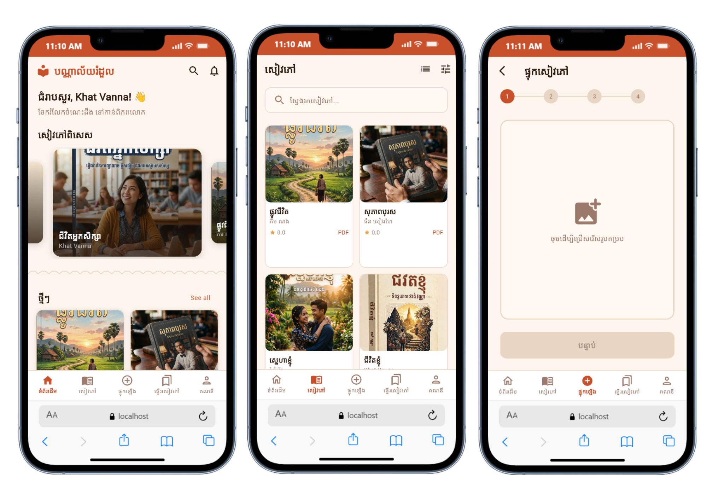
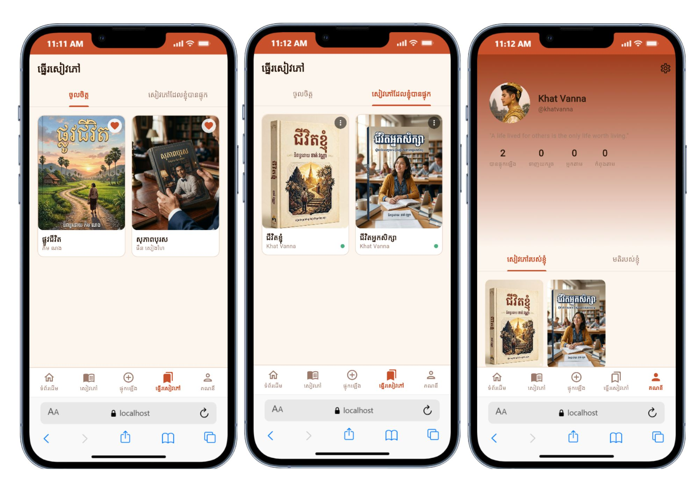

<div align="center">

# 🌸 Romduol Library

### Open-Access Khmer Digital Book Library

_Inspired by Cambodia's national flower — the Romduol_

[](https://flutter.dev)
[](https://laravel.com)
[](https://www.postgresql.org)
[](https://redis.io)
[](https://docs.docker.com/compose/)
[](LICENSE)

A full-stack digital library platform for discovering, reading, and sharing Khmer-language books.  
Built with **Flutter** on the frontend and **Laravel** on the backend, fully containerized with **Docker**.

---

</div>

## 📸 Screenshots

<div align="center">

|               Authentication               |          Home · Catalog · Upload           |
| :----------------------------------------: | :----------------------------------------: |
|  |  |

|       Bookshelf · My Books · Profile       |
| :----------------------------------------: |
|  |

</div>

---

## ✨ Features

<table>
<tr>
<td width="50%">

### 📱 Reader Experience

- Browse featured books & new arrivals
- Search & filter by category
- In-app PDF reader
- Download books for offline reading
- Rate & review books
- Bookmark favorites
- Follow other readers
- Share books with friends

</td>
<td width="50%">

### 🛡️ Admin Dashboard

- Approve / reject book submissions
- Feature selected books on homepage
- Manage users (ban / promote)
- View platform statistics
- Configure app settings

</td>
</tr>
<tr>
<td>

### 🌐 Platform

- Bilingual UI — **English** & **ខ្មែរ (Khmer)**
- Token-based auth (Laravel Sanctum)
- Multi-step book upload wizard
- User profiles with follower system
- Responsive across mobile & web

</td>
<td>

### 🏗️ Developer Experience

- Fully containerized (Docker Compose)
- One-command backend setup
- PostgreSQL + Redis stack
- Adminer DB dashboard included
- Seeded demo data for quick start

</td>
</tr>
</table>

---

## 🏛️ Architecture

```
Romduol_Library/
├── frontend/            # Flutter 3.22 — cross-platform client
│   ├── lib/
│   │   ├── core/        # Constants, themes, utilities
│   │   ├── data/        # Models, repositories, providers
│   │   └── presentation/# Screens, widgets, state management
│   └── assets/          # Fonts, icons, images, translations
│
├── backend/             # Laravel 11 — RESTful API
│   ├── app/
│   │   ├── Models/      # Eloquent models (Book, User, Category…)
│   │   ├── Http/        # Controllers, middleware, requests, resources
│   │   └── Services/    # BookService, FileUploadService
│   ├── database/        # Migrations & seeders
│   └── routes/api.php   # All API route definitions
│
└── infrastructure/      # Docker orchestration
    ├── docker-compose.yml
    └── docker/
        ├── nginx/       # Nginx web server config
        └── php/         # PHP-FPM Dockerfile & php.ini
```

---

## 🚀 Getting Started

### Prerequisites

| Tool                                                        | Version |
| ----------------------------------------------------------- | ------- |
| [Docker](https://www.docker.com/)                           | 20+     |
| [Docker Compose](https://docs.docker.com/compose/)          | 2.x     |
| [Flutter SDK](https://docs.flutter.dev/get-started/install) | 3.22+   |

### 1. Clone the repository

```bash
git clone https://github.com/<your-username>/Romduol_Library.git
cd Romduol_Library
```

### 2. Start the backend

```bash
cd infrastructure

# Copy environment file
cp ../backend/.env.example ../backend/.env      # macOS / Linux
copy ..\backend\.env.example ..\backend\.env     # Windows

# Spin up all services
docker compose up -d

# Install dependencies & bootstrap the app
docker compose exec app composer install
docker compose exec app php artisan key:generate
docker compose exec app php artisan migrate --seed
docker compose exec app php artisan storage:link
```

> The API is now live at **http://localhost:8000/api/v1**

### 3. Run the Flutter app

```bash
cd frontend
flutter pub get
flutter run
```

| Platform            | Backend URL                    |
| ------------------- | ------------------------------ |
| Web / iOS / Desktop | `http://localhost:8000/api/v1` |
| Android Emulator    | `http://10.0.2.2:8000/api/v1`  |

> The base URL is configured in `frontend/lib/core/constants/api_endpoints.dart`.

### 4. Access development tools

| Service          | URL                          |
| ---------------- | ---------------------------- |
| API              | http://localhost:8000/api/v1 |
| Adminer (DB GUI) | http://localhost:5051        |

---

## 🔑 Default Credentials

| Role     | Email               | Password       |
| -------- | ------------------- | -------------- |
| 🔒 Admin | `admin@romduol.lib` | `Admin@1234`   |
| 👤 User  | `sokha@example.com` | `Password@123` |

> These accounts are created automatically by the database seeder.

---

## 📡 API Reference

All endpoints are prefixed with `/api/v1`.

### Authentication

| Method | Endpoint                | Auth | Description            |
| ------ | ----------------------- | ---- | ---------------------- |
| `POST` | `/auth/register`        | —    | Create a new account   |
| `POST` | `/auth/login`           | —    | Login → Bearer token   |
| `POST` | `/auth/forgot-password` | —    | Request password reset |
| `POST` | `/auth/logout`          | ✅   | Revoke current token   |
| `GET`  | `/auth/me`              | ✅   | Get authenticated user |
| `POST` | `/auth/profile`         | ✅   | Update profile         |
| `POST` | `/auth/change-password` | ✅   | Change password        |

### Books

| Method   | Endpoint               | Auth | Description            |
| -------- | ---------------------- | ---- | ---------------------- |
| `GET`    | `/books`               | —    | Paginated book catalog |
| `GET`    | `/books/featured`      | —    | Featured books         |
| `GET`    | `/books/new-arrivals`  | —    | New arrivals           |
| `GET`    | `/books/search`        | —    | Search books           |
| `GET`    | `/books/{id}`          | —    | Book detail            |
| `GET`    | `/books/{id}/read`     | —    | Read book (PDF)        |
| `GET`    | `/books/{id}/reviews`  | —    | Book reviews           |
| `POST`   | `/books`               | ✅   | Upload a new book      |
| `PATCH`  | `/books/{id}`          | ✅   | Update book            |
| `DELETE` | `/books/{id}`          | ✅   | Delete book            |
| `GET`    | `/books/{id}/download` | ✅   | Download PDF           |
| `POST`   | `/books/{id}/favorite` | ✅   | Toggle favorite        |
| `POST`   | `/books/{id}/reviews`  | ✅   | Post a review          |

### User & Social

| Method | Endpoint                      | Auth | Description       |
| ------ | ----------------------------- | ---- | ----------------- |
| `GET`  | `/me/books`                   | ✅   | My uploaded books |
| `GET`  | `/me/favorites`               | ✅   | My favorites      |
| `GET`  | `/me/reviews`                 | ✅   | My reviews        |
| `GET`  | `/me/following`               | ✅   | Users I follow    |
| `POST` | `/users/{id}/follow`          | ✅   | Toggle follow     |
| `GET`  | `/users/{username}`           | —    | Public profile    |
| `GET`  | `/users/{username}/followers` | —    | User followers    |
| `GET`  | `/users/{username}/following` | —    | User following    |

### Admin (requires `admin` role)

| Method | Endpoint                    | Description              |
| ------ | --------------------------- | ------------------------ |
| `GET`  | `/admin/dashboard`          | Platform statistics      |
| `GET`  | `/admin/books`              | Pending book submissions |
| `GET`  | `/admin/users`              | All users                |
| `GET`  | `/admin/settings`           | App settings             |
| `POST` | `/admin/books/{id}/approve` | Approve a book           |
| `POST` | `/admin/books/{id}/reject`  | Reject a book            |
| `POST` | `/admin/books/{id}/feature` | Feature a book           |
| `POST` | `/admin/users/{id}/ban`     | Ban a user               |
| `POST` | `/admin/users/{id}/unban`   | Unban a user             |
| `POST` | `/admin/users/{id}/promote` | Promote to admin         |

---

## 🛠️ Tech Stack

| Layer                | Technology                                      |
| -------------------- | ----------------------------------------------- |
| **Frontend**         | Flutter 3.22 · Riverpod 2 · GoRouter 14 · Dio 5 |
| **Backend**          | Laravel 11 · Sanctum · Eloquent ORM             |
| **Database**         | PostgreSQL 16                                   |
| **Cache**            | Redis 7                                         |
| **Storage**          | Local disk (dev) / AWS S3 (prod)                |
| **Containerization** | Docker · Docker Compose                         |
| **Web Server**       | Nginx                                           |
| **Localization**     | English · Khmer (easy_localization)             |

### Frontend Packages

| Category         | Packages                                                                                      |
| ---------------- | --------------------------------------------------------------------------------------------- |
| State Management | `flutter_riverpod`, `riverpod_annotation`                                                     |
| Navigation       | `go_router`                                                                                   |
| Networking       | `dio`, `pretty_dio_logger`, `connectivity_plus`                                               |
| Storage          | `flutter_secure_storage`, `shared_preferences`, `hive_flutter`                                |
| PDF              | `syncfusion_flutter_pdfviewer`, `flutter_pdfview`                                             |
| UI               | `cached_network_image`, `shimmer`, `lottie`, `carousel_slider`, `flutter_staggered_grid_view` |
| Files            | `file_picker`, `image_picker`, `open_filex`, `share_plus`                                     |

---

## 🗄️ Database Schema

```
┌──────────┐       ┌───────────┐       ┌──────────┐
│  users   │──1:N──│   books   │──N:M──│   tags   │
└──────────┘       └───────────┘       └──────────┘
                     │       │
                    1:N     1:N
                     │       │
              ┌──────┘       └──────┐
              ▼                     ▼
         ┌─────────┐         ┌───────────┐
         │ reviews │         │ downloads │
         └─────────┘         └───────────┘

┌────────────┐
│ categories │──self-referencing (parent/children)
└────────────┘

┌──────────┐
│ settings │──app-wide key-value config
└──────────┘
```

---

## 📂 Docker Services

| Service     | Image         | Port   | Purpose                    |
| ----------- | ------------- | ------ | -------------------------- |
| **app**     | PHP 8.2 FPM   | —      | Laravel API                |
| **nginx**   | Nginx         | `8000` | Web server / reverse proxy |
| **db**      | PostgreSQL 16 | `5433` | Primary database           |
| **redis**   | Redis 7       | `6379` | Cache & sessions           |
| **adminer** | Adminer       | `5051` | Database management UI     |

---

## 📁 Frontend Screen Map

| Screen            | Description                                |
| ----------------- | ------------------------------------------ |
| **Onboarding**    | Welcome / splash screen                    |
| **Auth**          | Login & registration                       |
| **Home**          | Featured books, new arrivals, carousel     |
| **Catalog**       | Browse all books with search & filters     |
| **Book Detail**   | Cover, description, reviews, download      |
| **Reader**        | In-app PDF viewer                          |
| **Upload**        | Multi-step book upload wizard              |
| **Bookshelf**     | Favorites & uploaded books                 |
| **Profile**       | User info, followers, uploaded books       |
| **Search**        | Full-text book search                      |
| **Notifications** | Activity feed                              |
| **Admin**         | Dashboard, approval queue, user management |

---

## 🤝 Contributing

1. **Fork** the repository
2. **Create** a feature branch: `git checkout -b feature/amazing-feature`
3. **Commit** your changes: `git commit -m "Add amazing feature"`
4. **Push** to the branch: `git push origin feature/amazing-feature`
5. **Open** a Pull Request

---

## 📄 License

This project is licensed under the **MIT License** — see the [LICENSE](LICENSE) file for details.

---

<div align="center">

**Made with ❤️ in Cambodia 🇰🇭**

_Romduol (រំដួល) — Cambodia's national flower, symbolizing knowledge that blossoms for everyone._

</div>
# Romduol-Library-Mobile

